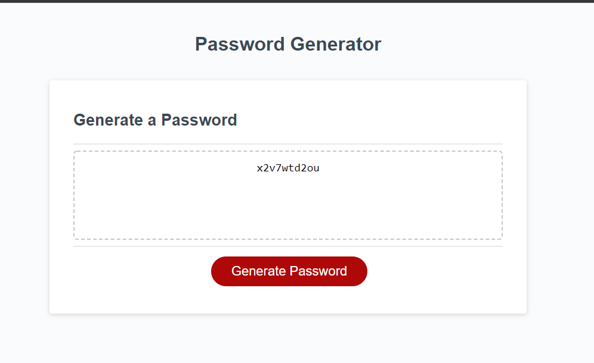

# Password Generator Project.

[Password Generator Page](https://jsnyder159.github.io/Password-Generator/)

Task: I was given the task to write the javascript code for for a random pasword generator as an employee with access to sensitive data.  This will help
create a stronger password and provide greater security.

Given a new security password protocol when I click on the generate password button it will present with a series of prompts for password criteria.  These prompts will include password length with a min char count of 8 and max char count of 128.  Include by personal choice the options for lower case alphabet, upper case alphabet, numbers, and special characters.  When I answer each prompt then my input should validate and include atleast one character of the selected type.  When all prompts are answered then the password must meet the criteria selected.  The password should be displayed either inside the box on the screen, or in an alert.

Steps taken in Javascript:

- Made arrays for all options (numbers, lower case, upper case, number).

- Made for the min/max variables.

- Made an empty array to store the arrays in once options were selected.

- Once clicking on the generate password button a prompt will open asking for to enter the wanted
length of the password (with min/max values in window). If the parameters requirments are met for the value the program moves one, if they arent you have to click the generate button again.

- Prompt opens if you want special characters, ok is yes and cancel is no.  If you select yes it will randomly select one special character and store it and then place the entire array into an empty array.  If no then it will not add a character for your password at random and will not store the array.

- This code is repeated for the upper case, lower case, and numbers.

- Finally the store items for your password are compared against the length selected at the start.  This is then subtracted from one another giving me the difference between the two.  Then a for loop is utilized to run through the array that was storing all the options selected for the password randomly.  Adding one each time until the password meets the length required.

- Once completed the password meeting the 1 of each selected option and length selected with randomly generated characters is displayed inside the box on the screen.

- Code added so that if no options were made an alert is given, not allowing the for loop to be ran, and the generate password button needing to be selected again to make the proper amount of choices to generate the password.
